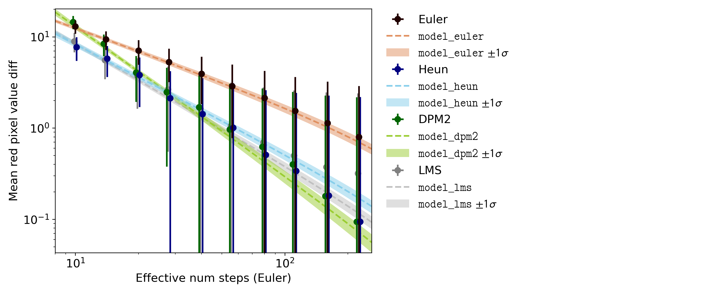

## Convergence

All deterministic (non-ancestral) samplers eventually converge against
the same image as the number of steps approaches infinity.
However, the speed of this convergence is not necessarily the same.
This analysis is concerned with determining differences in convergence speed between the deterministic samplers.

The prompt is "Flowers, red".
The x axis for the fit is the effective number of steps, normalized to the GPU time necessary to generate images
(on an NVIDIA GTX 1070).
The model $f(x; a, b) = a x^b$ is assumed to describe the difference in mean red pixel value to the limit at infinite steps.
Naturally this difference cannot be calculated directly.
Instead this difference is approximated by generating samples at 1000 steps and calculating
the differences relative to those samples.
To adjust for the fact that the samples presumably still have not fully converged at 1000 steps the model
is adjusted like this: $f(x; a, b) = a (x^b - 1000^b)$.
The y axis therefore represents the difference in mean red pixel value between samples generated at x steps relative to the samples generated at 1000 steps.

The x values at which data is collected are spaced logarithmically: 10, 14, 20, 28, 40, 56, 80, 112, 160, 226.
Because the Heun and DPM 2 samplers approximately require twice as much GPU time as the other samplers the number
of steps for those samplers was cut in half.
For Euler, Heun, DPM 2 and PLMS the seeds 0-89 were used to generate data.
For DDIM and PLMS the seeds 0-59 were used to generate data.

| Sampler | $a$                  | $b$                        | $\chi^2 / \mathrm{NDF}$ | $\chi^2$ Probability | Effective Step Length |
|---------|----------------------|----------------------------|-------------------------|----------------------|-----------------------|
| Euler   | $83.6^{+9.3}_{-8.3}$ | $-0.818^{+0.044}_{-0.046}$ | 1.547                   | 0.135                | 1.0                   |
| Heun    | $129^{+28}_{-24}$    | $-1.189^{+0.065}_{-0.065}$ | 1.746                   | 0.083                | 2.025                 |
| DPM 2   | $560^{+160}_{-120}$  | $-1.635^{+0.083}_{-0.086}$ | 0.935                   | 0.486                | 1.95                  |
| LMS     | $178^{+31}_{-27}$    | $-1.325^{+0.057}_{-0.059}$ | 1.459                   | 0.166                | 0.9875                |
| DDIM    | $48.9^{+6.4}_{-5.5}$ | $-0.703^{+0.053}_{-0.056}$ | 5.538                   | $4.99 \cdot 10^{-7}$ | 0.975                 |
| PLMS    | $83^{+68}_{-33}$     | $-1.21^{+0.19}_{-0.23}   $ | 7.086                   | $2.07 \cdot 10^{-9}$ | 0.975                 |

In the interval of 10 to 50 effective steps LMS is the fastest k-diffusion sampler.
Asymptotically DPM 2 seems to be faster but due to the diminishing returns at large numbers of steps this will
not be noticeable to humans.
The fit results for Euler, Heun, DPM 2, and LMS are good in terms of $\chi^2 / \mathrm{NDF}$ which indicates that
the model can accurately describe the data.
The fit results for DDIM and PLMS are bad (which is why they are not shown in the plot).
Presumably this is due to technical limitations of their implementations:
it was not possible to go beyond 500 steps so the reference images relative to which the differences are calculated
may not have sufficiently converged.

For practical purposes LMS seems to be the fastest.
Heun and DPM 2 are a close second.
Euler is significantly slower.
DDIM and PLMS cannot be compared because the fit results are bad.
